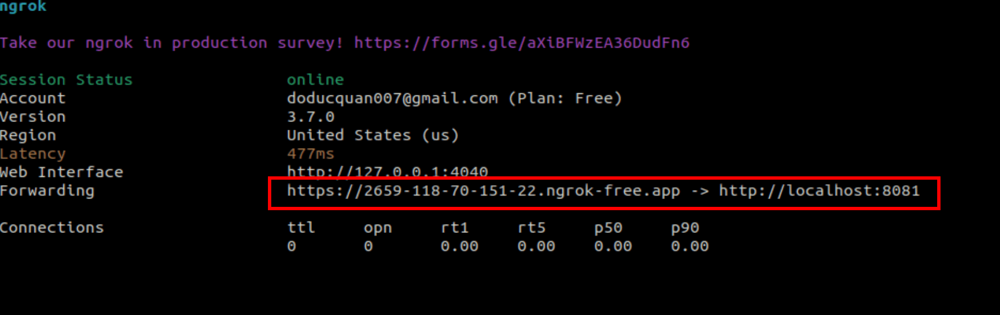

# CÀI ĐẶT JEBKINS BẰNG DOCKER


## I. CÀI ĐẶT JENKINS

LƯU Ý: CẦN TẠO THƯ MỤC jenkins trước để lấy dữ liệu về phát nha, đôi khi cần cấp cả quyền đọc, ghi cho nó!


```
version: '3.7'

services:
  jenkins:
    image: jenkins/jenkins:lts
    privileged: true
    user: root
    ports:
      - 8081:8080
      - 50000:50000
    container_name: jenkins
    volumes:
      - ./jenkins:/var/jenkins_home/workspace:rw
      - /var/run/docker.sock:/var/run/docker.sock
      - /usr/local/bin/docker:/usr/local/bin/docker
volumes:
  jenkins_data:

```


## II. CÀI ĐẶT NGROK.


LƯU Ý: NẾU CÓ LỖI GÌ ĐÓ VỀ VERSION THÌ XIN HÃY UPGRATE LẠI `ngrok config upgrade`


### BƯỚC : PUBLIC PORT THỬ NHA


`ngrok http 8081`: public port 8081.



---

*Danh mục tham khảo*

[1] https://github.com/digitalake/jenkins-docker-compose?tab=readme-ov-file

[2] 