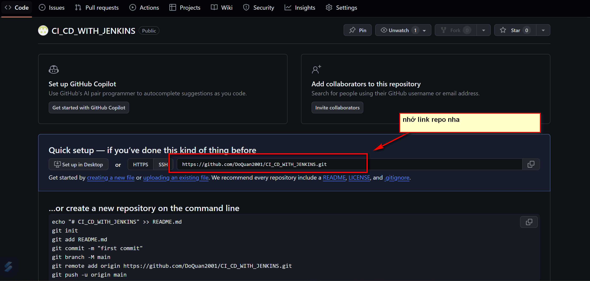
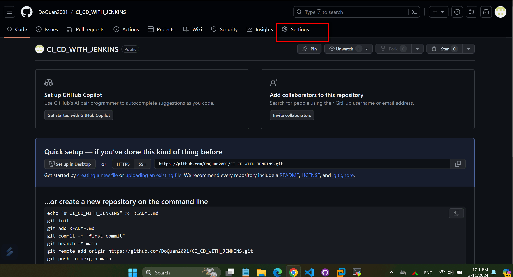
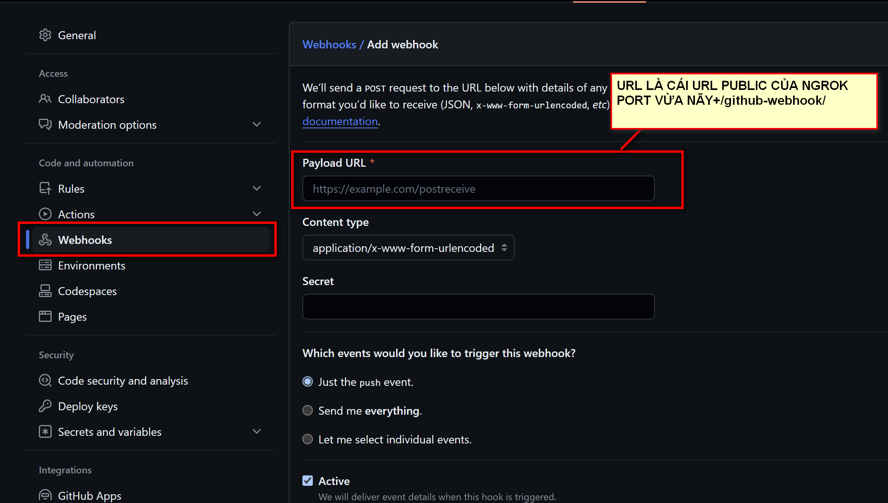
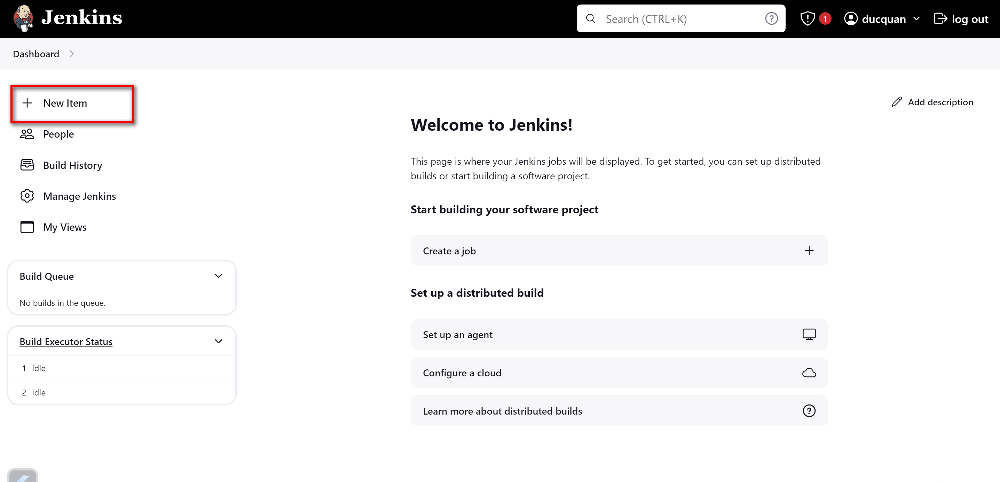
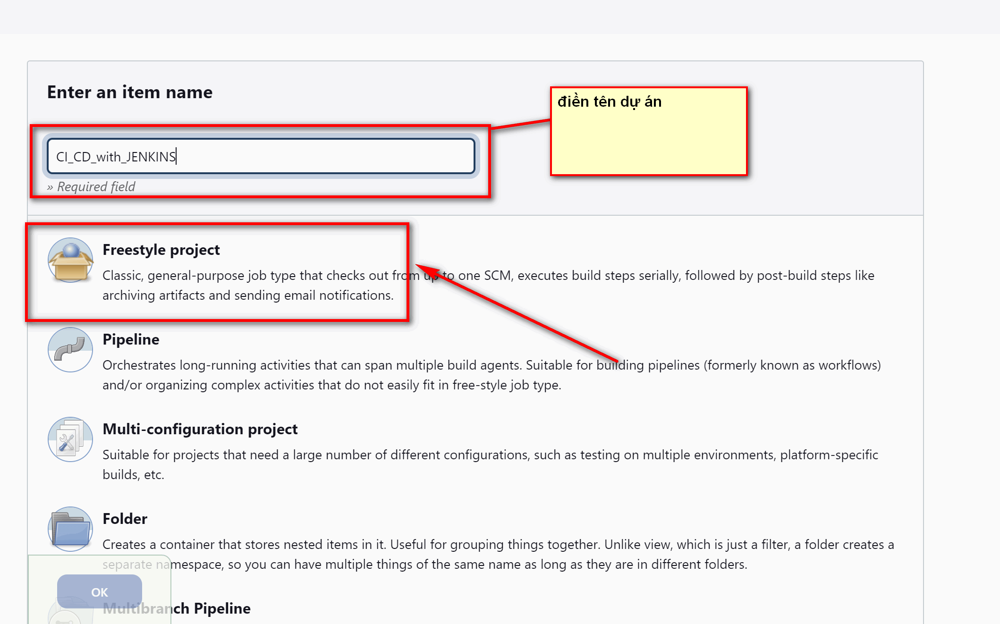
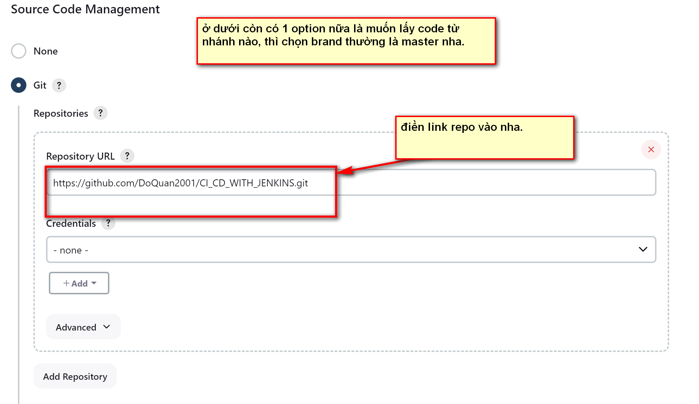
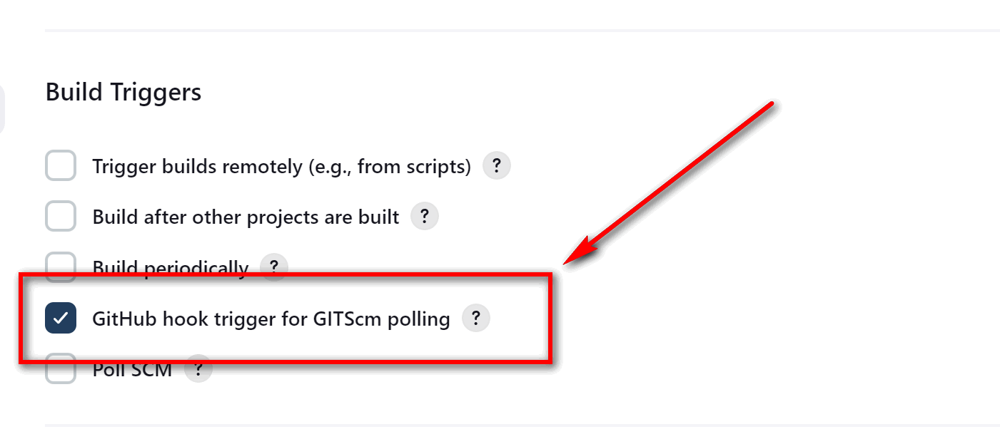

# TÍCH HỢP JENKINS VỚI GITHUB


## I. DÙNG FREESTYLE VỚI WEBHOOK.


### BƯỚC 1: CẤU HÌNH WEBHOOK TRÊN GITHUB.

TRUY CẬP TRANG GITHUB CỦA MÌNH. TẠO 1 REPO ĐỂ LƯU TRỮ DỰ ÁN. SAU ĐÓ LÀM TIẾP NHƯ SAU:










### BƯỚC 2: TẠO DỰ ÁN TRÊN JENKINS.













## II. CÁCH 2. DÙNG PINELINE.


### BƯỚC 1: TẠO JENKINFILE.


```

pipeline {
    agent any
    stages {
        stage('CLONE') {
            steps {
                
               git 'https://github.com/DoQuan2001/CI_CD_WITH_JENKINS.git'
            }
        }

    }
}


```

### BƯỚC 2: PUSH CODE LÊN GITHUB.


--- 

*DANH MỤC THAM KHẢO*


[1] https://viblo.asia/p/tich-hop-jenkins-voi-github-3RlL53Z24bB

[2]


