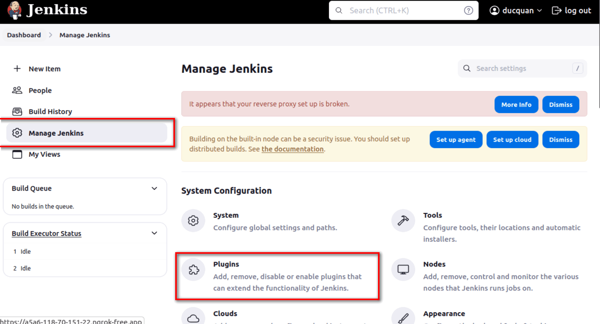
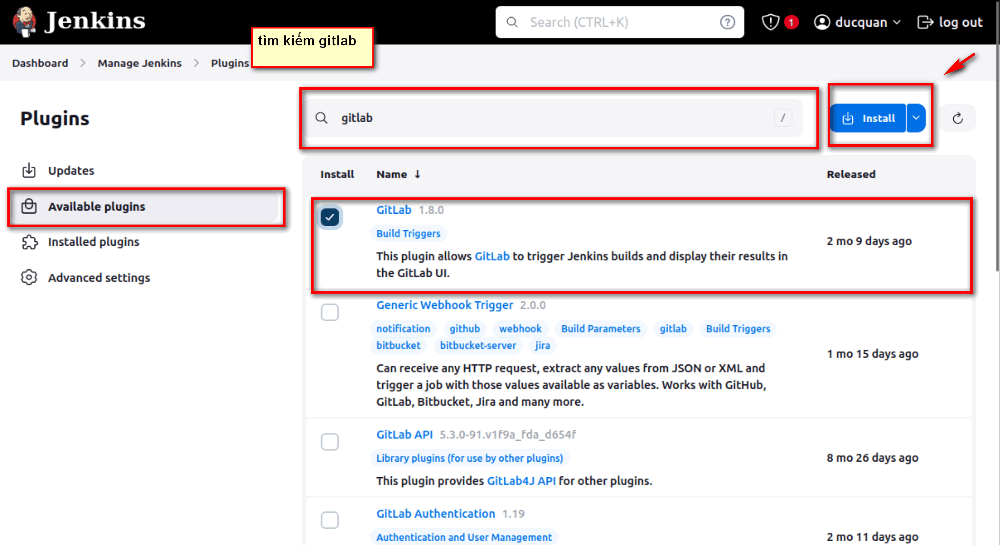
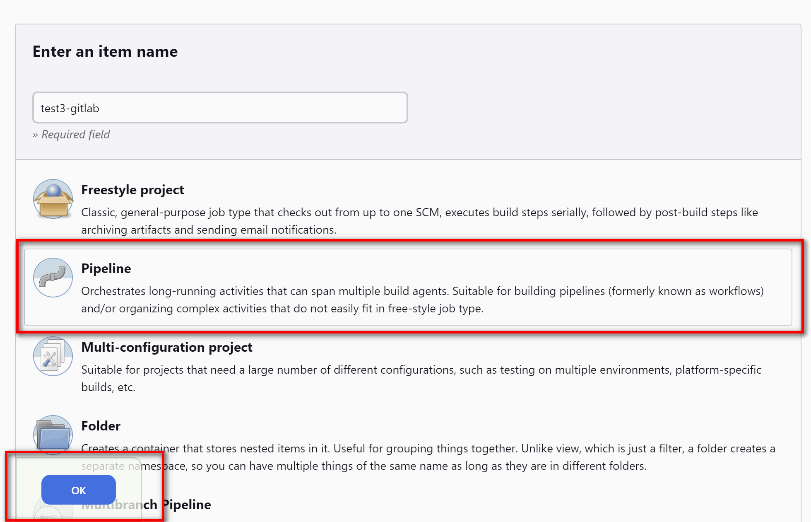
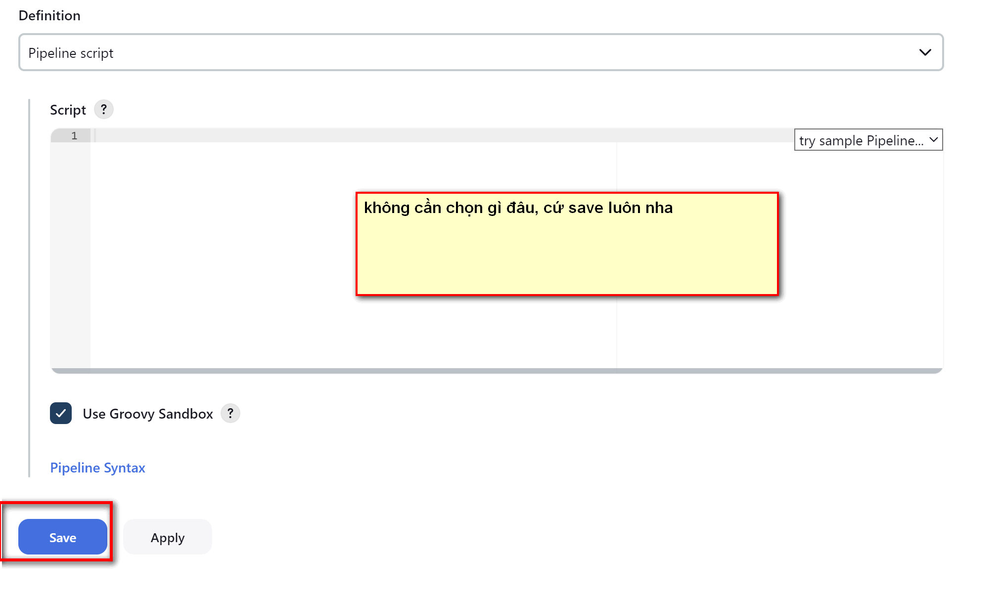
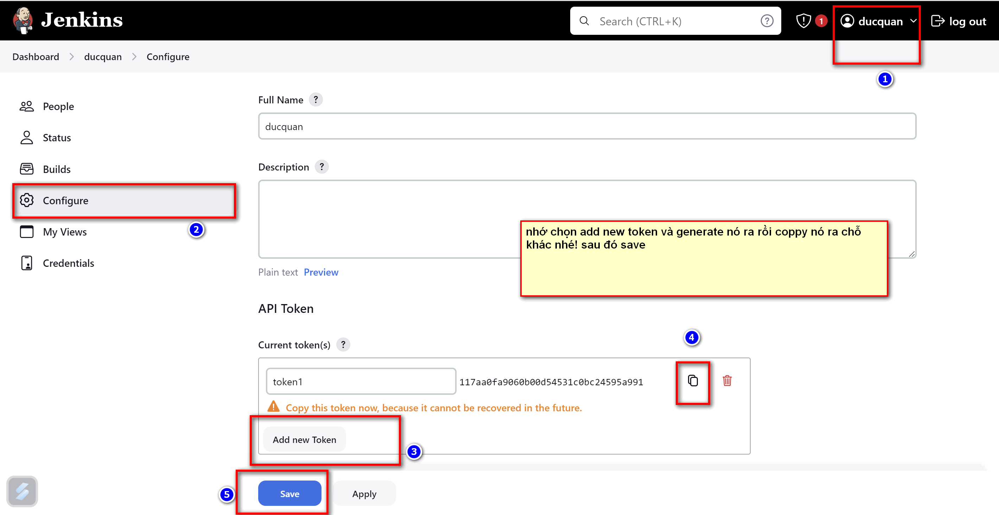
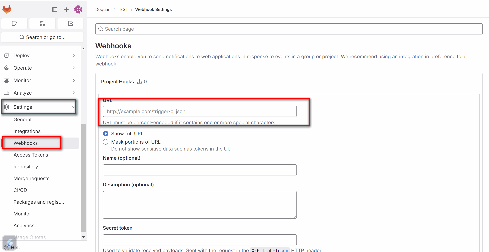

# TÍCH HỢP JENKINS VỚI GITLAB


## I. TẢI PLUGIN GITLAB CHO JENKINS.






SAU ĐÓ NÓ HỎI INSTALL SONG CÓ RESTART KHÔNG THÌ NHỚ TÍCH CHỌN


## II.  KẾT NỐI GITLAB VỚI JENKINS


### CÁCH 1: DÙNG JENKINS WEBHOOK.


#### BƯỚC 1: CẦN TẠO 1 PROJECT(REPO) TRÊN GITLAB.

#### BƯỚC 3: TẠO 1 ITEM JENKINS.







#### BƯỚC 3: TẠO TOKEN CHO ITEM JEKINS VỪA NÃY





#### BƯỚC 4: KẾT NỐI GITLAB VỚI JENKINS ITEM VỪA NÃY.

TRUY CẬP VÀO PROJECT TRÊN GITLAB. CHỌN SETTING VÀ LÀM TIẾP NHƯ SAU:


URL: https://usernamejenkins:token@ url cuar jekin nhung bo cai https:// ddi/project/ten item


sau do save va test nha.




### CÁCH 2: DÙNG JEKINS PINELINE JENKINFILE.

11518f4b9e138ba2c187bb47f3a7d641cd


```


```


